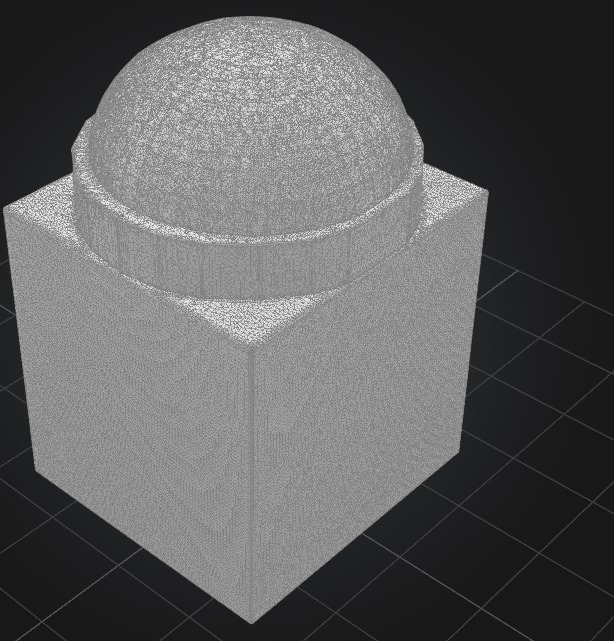
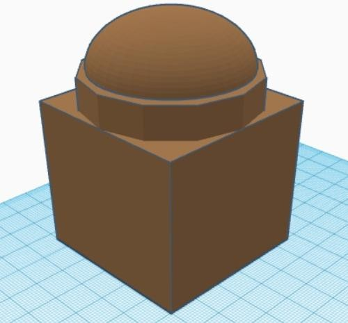
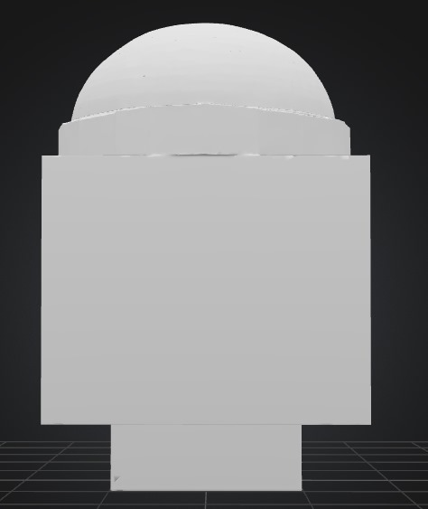
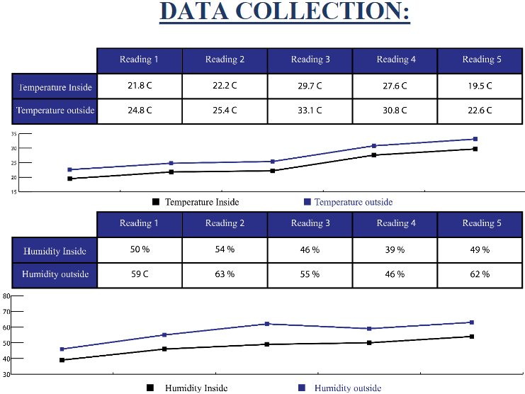
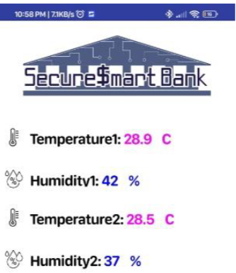
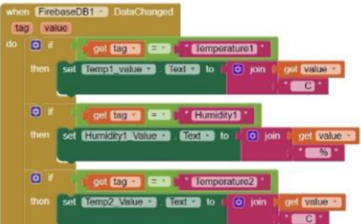

# Project Journal

## Title: *Secure_Smart_Bank*  
**Author**: Mina Romany Mina Habib  
**Description**: A smart and sustainable banking system integrating eco-friendly construction materials with embedded systems for automation, environmental monitoring, and real-time security control.  
**Start Date**: 23/06/2025  
**Total Time Spent**: 72 hours

---

## Daily Development Log

### 23/06/2025  
**Time Spent**: 6 hours  

This is the first day of my work on the *Secure_Smart_Bank* project. I took approximately six hours to sit down and brainstorm on the important details that I would want to incorporate when making the prototype. The main focus of my idea was to integrate automation and sustainability, this is why I started drawing some rough architectural ideas and describing the main concepts according to which the system was to operate. I also browsed around on various smart building models, and renewable energy implementations to get ideas. At the end of the working day, I already had a clear set of goals and a vision to lead my remaining tasks.

---

### 24/06/2025  
**Time Spent**: 6 hours  

Once I had the foundation of theory in place, I proceeded to the next stage drawing the first 3-dimensional layout of the construction. I spent around six hours trying various shapes which would help to be energy efficient, especially dome shapes that facilitate passive cooling. I have also started investigating into natural insulation material, with special interests in clay-straw mixes that have good thermal retention features. The more I was studying, the more I noted possible sources of these eco-materials and their characteristics regarding availability in the area and whether it is cost-efficient or not.

---

### 25/06/2025  
**Time Spent**: 4 hours  

This was a more techoriented day. I concluded on the general shape and the layout of the bank and commenced on the simplest computation as to the thickness of the walls and other space dimensions. Designs of airflow patterns to achieve proper natural ventilation were also simulated by me in attempt to reduce the use of artificial cooling systems. Even though this was a shorter session (approximately four hours), it made it clearer to reinforce the literal aspects that would have to be followed in the subsequent procedures.
- 

---

### 26/06/2025  
**Time Spent**: 5 hours  

I changed to the embedded system part of the project. Today my task was to design the power distribution network of the ESP32 microcontroller. I determined what sensors I was going to incorporate and started to make a diagram of how things were going to be hooked up. I calculated on average five hours of experimenting with the circuit layouts and the efficient management of power in all the modules.

---

### 27/06/2025  
**Time Spent**: 5 hours  

I started to breadboard the sensor logic today. I began with the PIR motion sensor and it has worked well networking with the ESP32. I have also soldered a DHT11 sensor, and tried to debug bar-jumping temperature readings. It took me five hours to complete this session and it was well worth the time to know that I was starting to see the system react to real environmental input.

---

### 28/06/2025  
**Time Spent**: 4 hours  

I focussed on the renewable energy inputs. My design is based on two-input which utilizes solar panels and miniature water turbine. On flow rate estimates, I did a corresponding calculation of the RPM at which the turbine must run and power levels approximations of both sources. However short (just four hours), the session was an engulfing step on its way to providing the project with energy autonomy.

---

### 29/06/2025  
**Time Spent**: 4 hours  

Still on the power systems, I carried out various tests on the systems of loads with the use of a multimeter. I recorded and analyzed the number of battery charge and discharge cycles and the amount of time the system may operate on two 18650 lithium-ion batteries. The tests provided a better insight into the power consumption profile and allowed me to make more informed plans in the uptime expectations.

---

### 30/06/2025  
**Time Spent**: 6 hours  

The merging of both the hardware and software started to form today. I linked my Firebase real-time database with interface created in the MIT App Inventor, and communicated with the ESP32. I was able to put in place the temperature notifications and the alerts were able to push the mobile phone in real time. Six hours of intense, very satisfying work--it began to seem to be a working system.

---

### 01/07/2025  
**Time Spent**: 6 hours  

My intended outcomes today were to finish the smart door locking mechanism. To have an automatic access, I came up with a trigger system comprising of PIR sensor and a servo motor. I had problems with false motion detection and slow response of servos but debugged and implemented a buzzer system that audibly notifies of suspicious entries. It used up all the six hour, the outcome was functional and dependable.

---

### 02/07/2025  
**Time Spent**: 5 hours  

This was more of refining session. I captured the complete architecture of the system, and each of the modules was duly captured. I also settled on each sensor placement and calculated the best position in regards to angles a detection is made at, range of coverage and its accessibility. It was awesome to introduce more shape to the project and to get near to the final build.

---

### 04/07/2025  
**Time Spent**: 5 hours  

I resorted to circuit design and had spent five hours designing a more detailed and realistic wiring diagram. I added a relay module to be able to drive external devices a pump and lights. Once everything has been put together virtually, I checked voltages on all those major pins to make sure that they indicated safe operating levels. Now I was comfortable with the electric soundness of the system.

---

### 05/07/2025  
**Time Spent**: 6 hours  

My principle activity today was the implementation of sound detection into the application. I modeled the behaviour in which the system got an opportunity to respond to audio signals e.g. turning the lights on in case of a knock. I also included a logic in the app which would enable restoration of data in case a loss or a failure of sync is experienced. The day was long, but the system now seemed more lively and interactive to the real-life.

---

### 06/07/2025  
**Time Spent**: 5 hours  

Having done the bulk of the development work, I had switched to closing things down. I sorted through all the documentation, collected pictures and screen shots of the system operating and photographing wiring and the pin out diagrams carefully. Five hours may not have been sufficient to give everything the perfectness I dreamt but it bound everything together in a manner that I took pride in.

---

### 07/07/2025  
**Time Spent**: 5 hours  

The last day I completed the bill of materials (BOM), re-checking all the components and sources of materials. I did my README file, completed this journal and met with my mentor to ensure that all the major calculations were done especially the one concerning energy consumption and materials. Their input made the project look valid and due to this, the project was sealed in a confident manner.

---

## Visual Documentation

### System Development Images
- 
- 

### Expected Results
- 

### System Analysis
- 
- 

### Theoretical Concepts Referenced
- 

