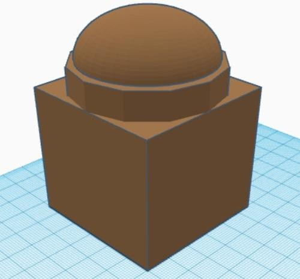
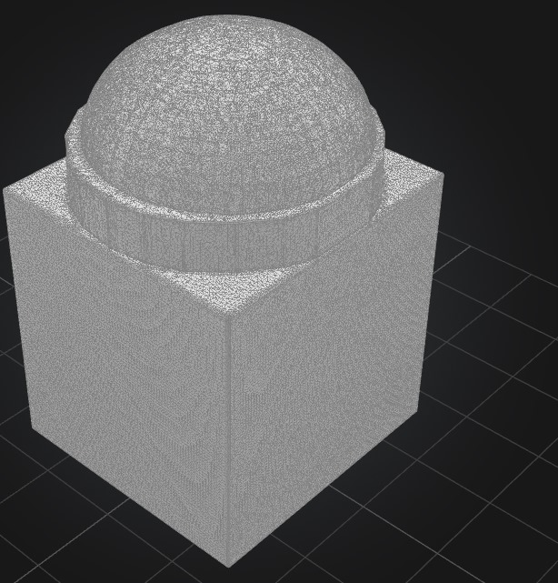

# Secure_Smart_Bank

### Description
Secure_Smart_Bank is a sustainable, low-energy smart bank prototype built using eco-friendly materials like clay and straw. Designed for off-grid or low-resource regions, the structure incorporates green architecture and smart embedded systems powered by ESP32.

### Why I Made the Project
The rise in energy consumption and environmental impact from modern infrastructure called for a solution that is both technologically advanced and eco-conscious. I developed this project to see how renewable energy, automation, and traditional construction materials can integrate into a sustainable and secure smart building for banking services.

### Screenshots
- 
- 
- 

---

### Bill of Materials (BOM)

| # | Component                        | Description                             | Price (USD) | Source |
|---|----------------------------------|-----------------------------------------|-------------|--------|
| 1 | ESP32 Dev Board                  | Central controller with Wi-Fi/Bluetooth | $9.90       | [Link](https://thepihut.com/products/esp32-wroom-32) |
| 2 | Breadboard (830 pts)            | For circuit prototyping                 | $5.95       | [Link](https://www.adafruit.com/product/239) |
| 3 | 25× Jumper Wires (M-M)         | For wiring connections                  | $9.00       | — |
| 4 | 2× DHT11 Sensors                | Temperature & humidity sensors          | $15.80      | [Link](https://www.dfrobot.com/product-2391.html) |
| 5 | 4-Water Pump (5V)              | Fountain cycling                        | $22.00      | [Link](https://www.dfrobot.com/product-2374.html) |
| 6 | 2× Power Switches              | Manual control of power lines           | $5.00       | [Link](https://www.adafruit.com/product/1125) |
| 7 | 2× 3.7V Li-ion Batteries       | Rechargeable batteries                  | $10.00      | [Link](https://www.adafruit.com/product/1781) |
| 8 | Battery Holder (2×18650)       | Battery pack holder                     | $8.00       | — |
| 9 | 2× Servo Motors                | Smart door control                      | $23.00      | [Link](https://www.dfrobot.com/product-959.html) |
| 10| Buzzer (Active)                | Audio alerts                            | $4.50       | [Link](https://www.dfrobot.com/product-399.html) |
| 11| 10× Diode (1N4007)             | Motor protection                        | $5.00       | — |
| 12| DC Motor (3–12V)               | Water turbine                           | $29.00      | [Link](http://dfrobot.com/product-1210.html) |
| 13| DC Motor (3–24V)               | Power generation                        | $17.00      | [Link](https://www.dfrobot.com/product-582.html) |
| 14| 2× PIR Motion Sensors          | Motion detection                        | $58.00      | [Link](https://www.dfrobot.com/product-2282.html) |
| 15| Lithium Battery Charger        | TP4056 charging module                  | $9.00       | — |
| 16| OLED Display (128x64 I2C)      | Displays readings                       | $14.90      | [Link](https://www.dfrobot.com/product-1576.html) |
| 17| Solar Panel (6V 1W)            | Additional renewable source             | $21.00      | [Link](https://voltaicsystems.com/P101C/?searchid=0&search_query=) |
| 18| Relay Module (4-channel)       | Load control                            | $27.90      | [Link](https://www.dfrobot.com/product-2349.html) |
| 19| Water Level Sensor             | Auto-fountain management                | $10.90      | [Link](https://www.dfrobot.com/product-2116.html) |
| 20| SD Card Logging Module         | ESP32 data logger                       | $9.19       | — |
| 21| Sound Sensor Module            | Noise-triggered features                | $7.50       | [Link](https://www.dfrobot.com/product-366.html) |
| 22| Soil Moisture Sensor           | Optional environmental sensing          | $14.90      | [Link](https://www.dfrobot.com/product-2054.html) |
|   | **Total**                      |                                          | **$327.54** |        |

## Note
the price of the materials will be less than this but this is what i found online, i also intend to get the fund in (reimbrusement) way.

